   
# Always Color Text
Color & highlight keywords, status words, dates, names, ***anything***! Once assigned, colors appear automatically throughout your vault in both Live Preview and Reading view.

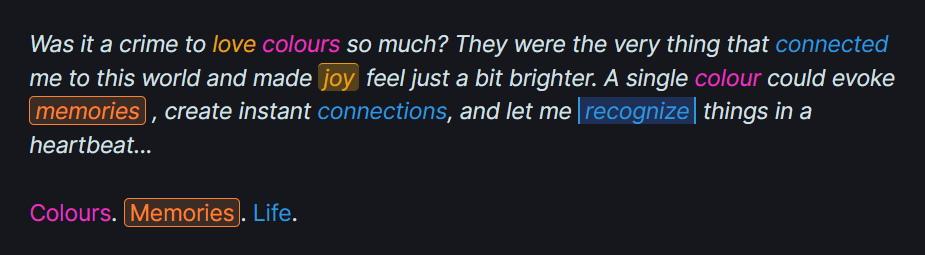

**Just select a word → pick a color → watch it appear everywhere.** Lightning-fast performance.

Whether you're a writer tracking characters, a student highlighting key terms, or someone who wants to recognize important words at a glance, this plugin adapts to your workflow.

---

## Color Anything, Exactly How You Want

### Smart Color Picker
Color text, add highlights, or both, right from a simple modal. 
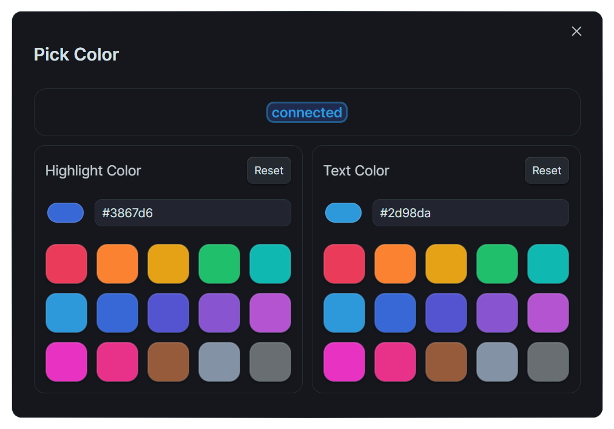

Customize your interface by hiding panels you don't need.
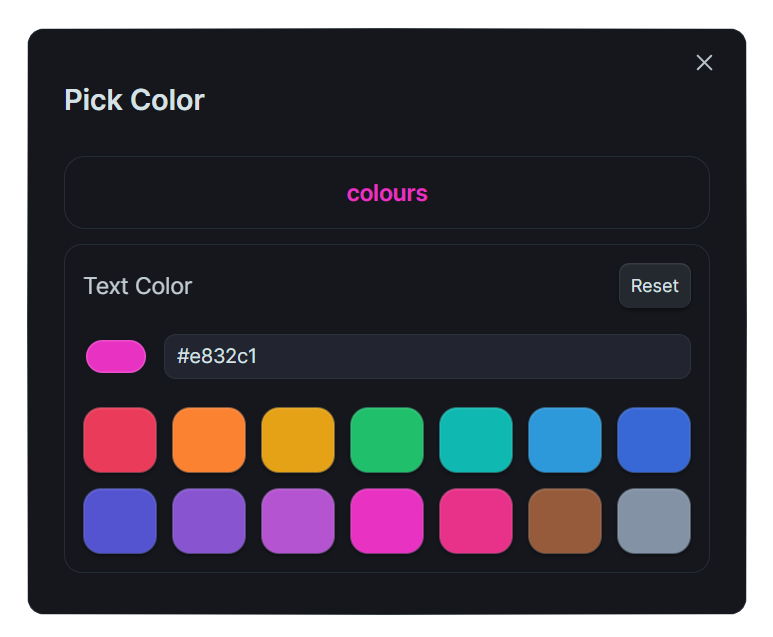

### Customizable Highlights
Make highlights look exactly how you imagine: adjust borders, rounded corners, transparency, and more.
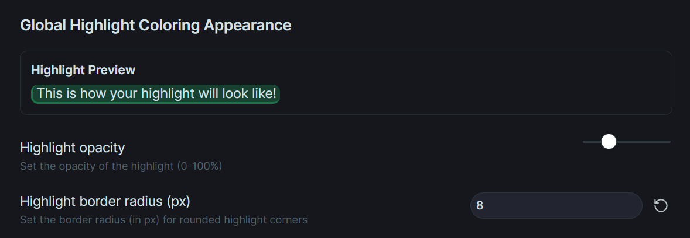

### Your Color Palette
Replace default swatches with your favorite colors for instant access!
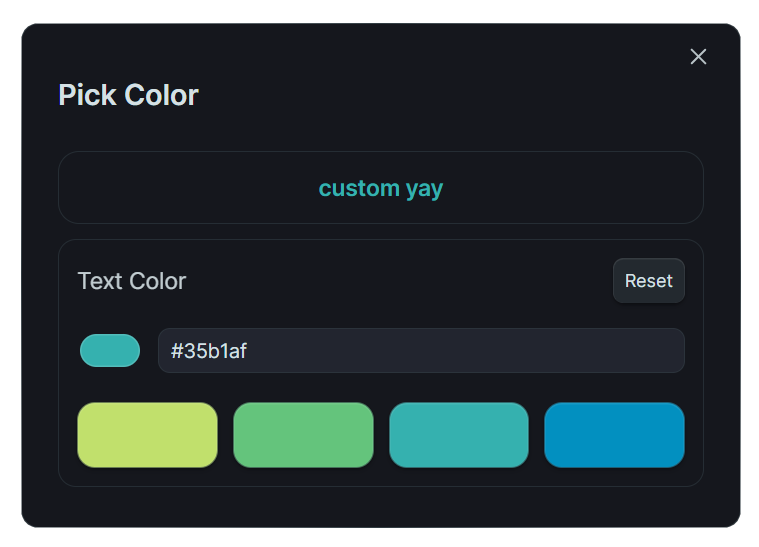

---

## Smart Text Matching

### Case Sensitivity & Partial Matching
- **Case sensitive**: "art" colors only "art", not "Art" or "ART"
- **Partial matching**: "art" colors "artist", "artisan", "cart"  
- **Both enabled**: Matches case first, then colors whole word

### Advanced Pattern Matching with Regex
Color complex patterns like dates, currencies, or specific text structures:
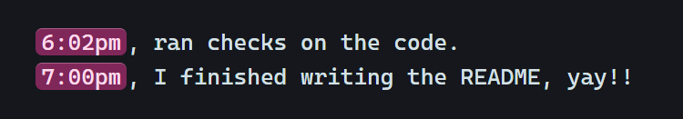

**Common patterns:**
- `\b\d{4}-\d{2}-\d{2}\b` → Dates like 2024-01-19
- `\bTODO|DONE|WIP\b` → Status words
- `\$\d+\.\d{2}` → Currency amounts
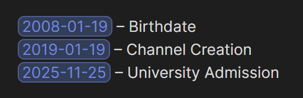

**Quick tips:**
- Enable "Use Regex" in your color entry settings
- Test patterns at regex101.com first if unsure
- Use **presets** for common patterns

---

## Organize Your Colors

### Centralized Word Management
All colored texts appear in settings with search and multiple sort options.
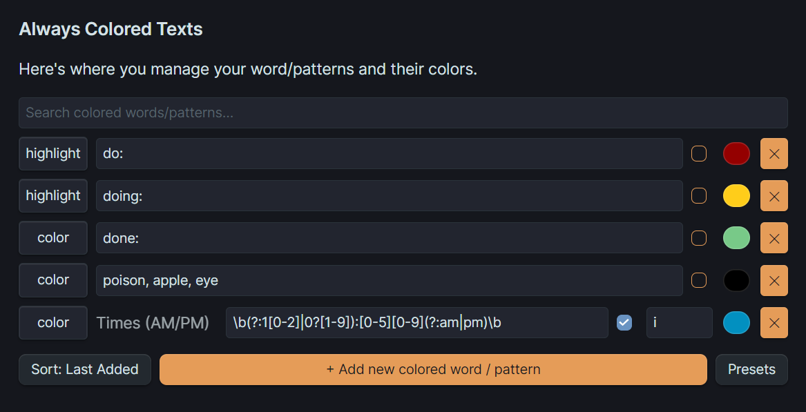

Switch styles seamlessly, changing from "Both" to "Highlight" and back retains your original colors.
<!--  -->

### File & Folder Control
Set different color schemes for different projects. Use "Include" to color specific documents or "Exclude" to disable coloring in entire folders.
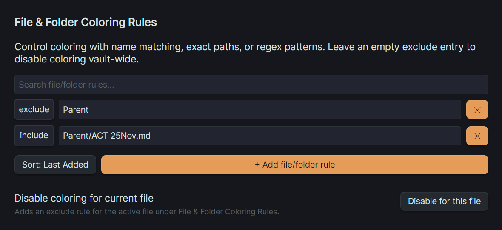

**Note**: File-level rules override folder-level rules, giving you precise control.

---

## Performance & Safety

### Built-in Protection
- **Pattern validation** automatically blocks problematic regex
- **Progressive loading** colors visible content first
- **Memory monitoring** prevents slowdowns
- **Active file only** coloring for optimal performance

### Reading Mode Note
For best results in Reading mode, enable **"Force full render"** in settings. This ensures smooth coloring but is disabled by default to prevent potential performance issues.

---

## Real-World Uses
- **Status tracking**: Color `TODO`, `INPROGRESS`, `DONE` in different colors
- **Writing projects**: Highlight character names, locations, and key plot points
- **Learning & study**: Make key terms and vocabulary stand out
- **Technical documentation**: Color code warnings, notes, and important sections
- **Project management**: Highlight priorities like `!!!URGENT!!!` or `Low-Effort`

---

## Installation
Available in Obsidian Community Plugins. Check [Release Notes](https://github.com/Kazi-Aidah/always-color-text/releases) for updates and new features.

**Known issue**: Colored text inside links may render without your set color in Live Preview mode due to Obsidian's rendering engine.

### Questions or Suggestions?
Create a new issue [here](https://github.com/Kazi-Aidah/always-color-text/issues) to report bugs or request new features!

---

## My personal favourite use cases,
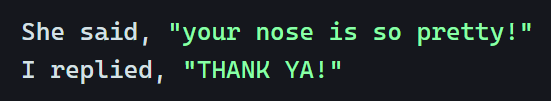
pattern: `"[^"]*"`
requirements: Disable Regex Safety

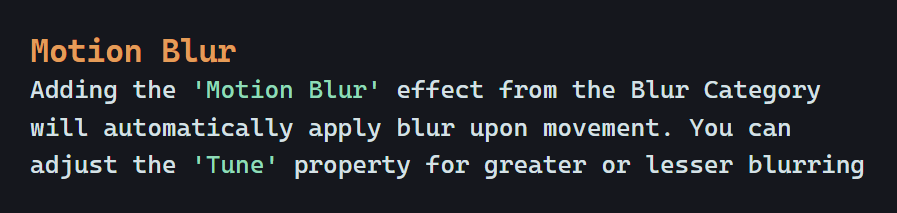
pattern: `'[^']*'`
requirements: Disable Regex Safety

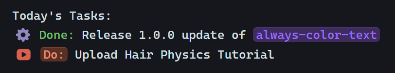