   
# Always Color Text
Color & highlight keywords, status words, dates, names, ***anything***! Once assigned, colors appear automatically throughout your vault in both Live Preview and Reading view.


**Just select a word → pick a color → watch it appear everywhere.** Lightning-fast performance.


Whether you're a writer tracking characters, a student highlighting key terms, or someone who wants to recognize important words at a glance, this plugin adapts to your workflow.

---

## Color Anything, Exactly How You Want

### Unified Color Picker
Color text, add highlights, or both, right from a simple modal. 


Customize your interface by hiding panels you don't need.


### Customizable Highlights
Make highlights look exactly how you imagine: adjust borders, rounded corners, transparency, and more.


### Your Color Palette
Replace default swatches with your favorite colors for instant access!


### Quick Actions
- **Quick Colors**: Choose a text color and background color group that appears directly in the right click menu.
  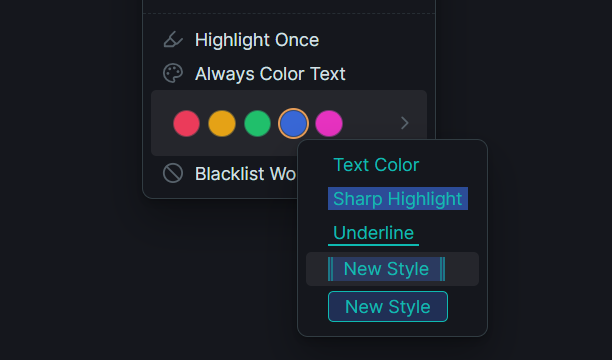

- **Quick Styles**: Apply a highlight style to selected text.
  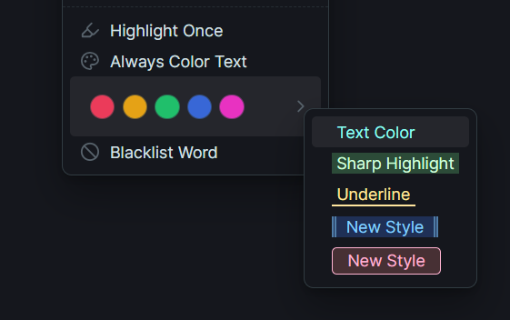

If **Quick Colors** are enabled, the style uses the selected Quick Color. If they are disabled, the style falls back to its own colors and inherits the styling from the first Quick Style entry. If no Quick Style exists, the default styling is applied.

Word Groups and Match Types can also be assigned to a Quick Style!

---

## Smart Text Matching

### Match Types
Control *how* text is matched with flexible, per-entry options:

- **Contains** – matches anywhere in the word or text
- **Exact** – matches the full word only
- **Starts with** – matches text that begins with the entry
- **Ends with** – matches text that ends with the entry

### Per-Entry Configuration
Customize the styling and rules for each colored entry via "Edit Entry Details":

- **Case Sensitivity**  
  When enabled, matches respect letter casing.  
  `"art"` matches `"art"` but not `"Art"` or `"ART"`.

- **Highlight Styling**  
  Adjust borders, rounded corners, transparency, and more per entry. Customize the look of individual entries without affecting others.
  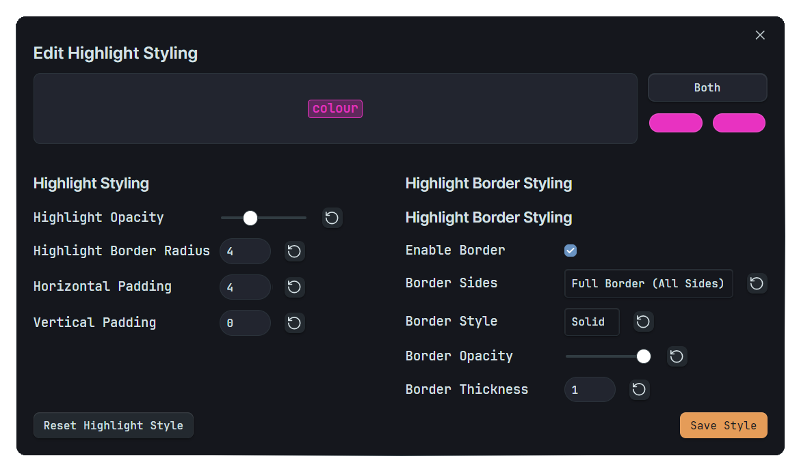

- **Inclusion / Exclusion Rules**  
  Exclude specific folders, files, or **files with specific tags** from coloring, or limit coloring to specific folders.
  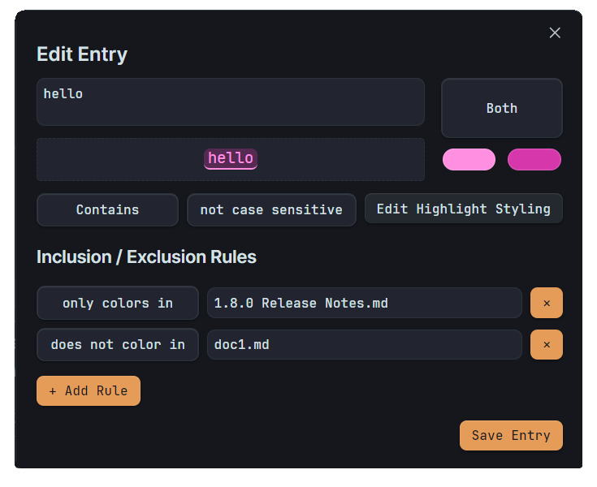

<!-- - **Partial Match**  
  This setting controls the default match type when creating new entries:
  - **Disabled** → new entries are added as **Exact** matches
  - **Enabled** → new entries are added as **Contains** matches -->

### Advanced Pattern Matching with Regex
Color complex patterns like dates, currencies, or specific text structures automatically:


**Built-in Regex Tester**
Test patterns instantly before applying them! The Regex Tester lets you preview matches and fine-tune expressions right in Obsidian.
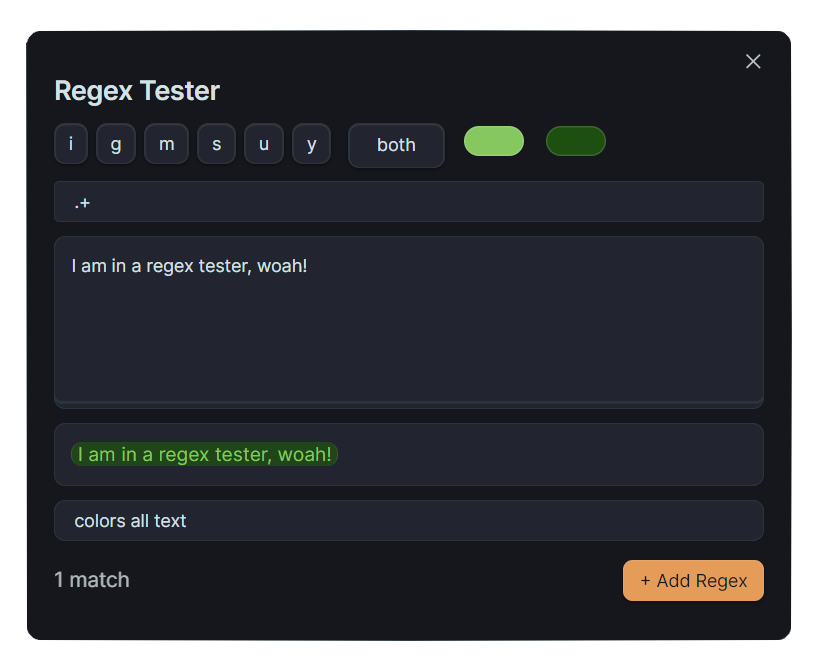

**Ready-to-Use Presets**
Jumpstart your coloring with curated pattern collections:
- **Markdown Formatting** – Headings, lists, tasks, comments, and links
- **Brackets** – Color content inside [square], {curly}, (round), \<angle>, and "double quote" brackets
- **Other Patterns** – Dates, times, emails, @mentions, currencies, and measurements

**Common patterns:**
- `\b\d{4}-\d{2}-\d{2}\b` → Dates like 2024-01-19
- `\bTODO|DONE|WIP\b` → Status words
- `\$\d+\.\d{2}` → Currency amounts


**Quick tips:**
- Enable "Use Regex" in your color entry settings
- Test patterns in the built-in **Regex Tester** before applying them
- Apply **presets** for common patterns with one click

---

## Organize Your Colors

### Centralized Word Management
All colored texts appear in settings with search and multiple sort options.
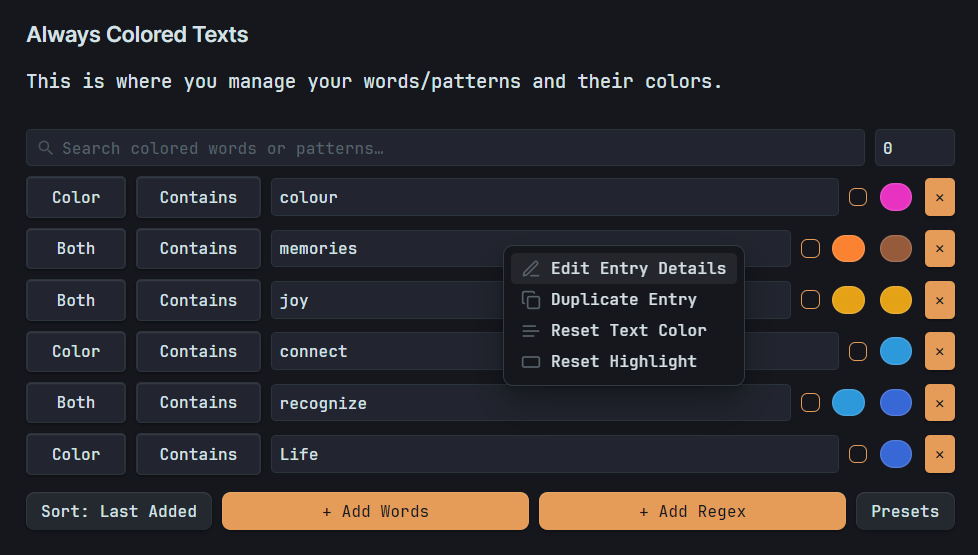
Tip: Right-click on any color picker to bring the Color Picker Modal.

Switch styles seamlessly, changing from "Both" to "Highlight" and back retains your original colors. Right-click any entry to **edit it**, **duplicate it** or **open in Regex Tester** for quick adjustments.

### Word Groups
Entries can be added to a word group right from the Pick Color modal, and the word group can be set as active when you need it, otherwise kept inactive. Your wish.

You can also set a **match type** and **case sensitivity** for all the entries in a word group.
Also, **enable or disable entire word groups** for specific folders or files containing specific tags!

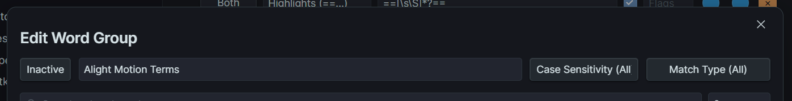

**Note:** Use `/` to target root folder (whole vault) for the Enable in/Disable in.

### Word Group Styling
You can style the word group itself! This styling will be applied to all entries within that group.
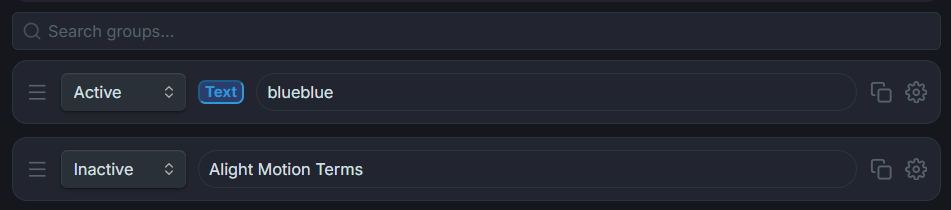

### Entry Filtering (Limit Input)
Use the **limit input** beside the search bar (also available in the "Add to Existing Entry" modal) to instantly filter entries by type, match type, or count.

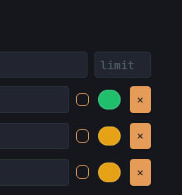
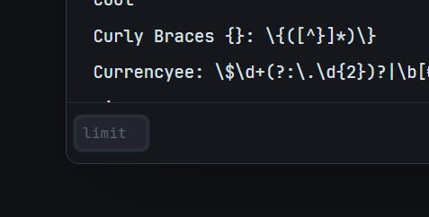

**Available limit filters:**

**Count & Display:**
- `0` (zero) → show all entries
- `N` (number) → show only the last N entries

**Filter by Type:**
- `r` → regex entries only
- `w` → word entries only
- `c` → colored text entries
- `h` → highlighted entries
- `b` → both, text + highlight entries

**Filter by Match Type:**
- `e` → exact match-type entries
- `sw` → starts-with match-type entries
- `ew` → ends-with match-type entries

### Add to Existing Entry
Right-click any entry and choose "Add to Existing Entry" to add the selected text to that entry:
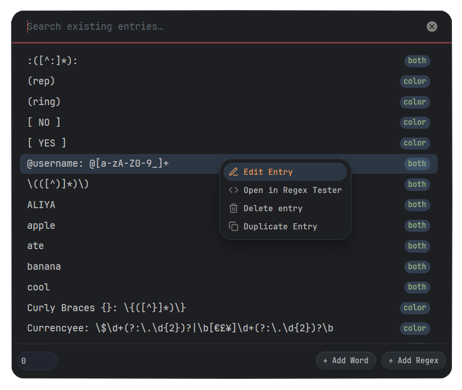

### File & Folder Control
Use "Include" to color specific documents or "Exclude" to disable coloring in entire folders.
You can now create rules based on tags! Include or exclude files that contain specific tags (e.g., `#private`, `#draft`).


**Note**: File-level rules override folder-level rules.

---

## Theme Compatibility

### Light & Dark Mode Text Fixers
Ensure your colors look great in any theme!
- **Dark Mode Text Fixer**: If you usually set colors in **Light Mode**, turn this on. It automatically adjusts dark text colors to be readable in Dark Mode.
- **Light Mode Text Fixer**: If you set colors in **Dark Mode**, turning this on will adjust light text colors to be visible in Light Mode.

---

## Performance & Safety

### Built-in Protection
- **Pattern validation** automatically blocks problematic regex
- **Progressive loading** colors visible content first
- **Memory monitoring** prevents slowdowns
- **Active file only** coloring for optimal performance

### Optimization Settings
- **Lightweight Mode**: Skips partial match expansion and uses a stricter match limit for maximum performance.
- **Smart Updates**: Only updates active lines of the document to keep the editor responsive.
- **Word Completion Color:** Renders text colors only after a space has been inputted, helps significantly with typing performance. *(This improves typing performance the most!)*

### Reading Mode Note:
For best results in Reading mode, enable **"Force full render"** in settings. This ensures smooth coloring but is disabled by default to prevent potential performance issues.

---

## Real-World Uses
- **Status tracking**: Color `TODO`, `INPROGRESS`, `DONE` in different colors
- **Writing projects**: Highlight character names, locations, and key plot points
- **Learning & study**: Make key terms and vocabulary stand out
- **Technical documentation**: Color code warnings, notes, and important sections
- **Project management**: Highlight priorities like `!!!URGENT!!!` or `Low-Effort`


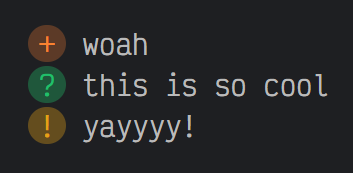
Note: Coloring symbols affect word coloring, not just the symbol itself.
Using symbols like `+` may trigger bullets so color `\+` instead.

---

## Installation
Available in Obsidian Community Plugins. Check [Release Notes](https://github.com/Kazi-Aidah/always-color-text/releases) for updates and new features.

### Questions or Suggestions?
Create a new issue [here](https://github.com/Kazi-Aidah/always-color-text/issues) to report bugs or request new features! I love seeing new issues for me to fix \\(≧ᗜ≦)/ and this plugin wouldn't have advanced so far without the feedback from users!!


---

## Contributing Translations
Want to add your language to Always Color Text?

1. Go to `src/i18n/` and copy `en.js`.
2. Rename it to your language code (like `es.js`, `fr.js`).
3. Translate the values only, like this:

```js
{
    "notice_import_completed": "ইম্পোর্ট সম্পন্ন",
    "key": "translation"
}
```

4. Go to `src/i18n.js` and add your language code to the list of supported languages.

5. Submit a pull request with your translation file in `src/i18n/`.

That's it! Your language will be available to all users.

### Contributors
- [@wanghong322](https://github.com/wanghong322) – Simplified Chinese Translation
- [@Frumkin13](https://github.com/Frumkin13) – Russian Translation

Thanks a lot to them for taking the time to translate Always Color Text!
