   

# Always Color Text

Color & highlight keywords, status words, dates, names, ***anything***! Once assigned, colors appear automatically throughout your vault in both Live Preview and Reading view.

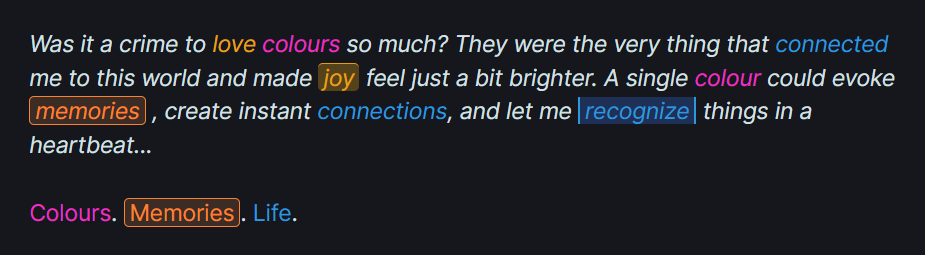

**Just select a word → pick a color → watch it appear everywhere.** Lightning-fast performance.


Whether you're a writer tracking characters, a student highlighting key terms, or someone who wants to recognize important words at a glance, this plugin adapts to your workflow.

<!-- ## Table of Contents

- [Color Anything, Exactly How You Want](#color-anything-exactly-how-you-want)
  - [Unified Color Picker](#unified-color-picker)
  - [Customizable Highlights](#customizable-highlights)
  - [Custom CSS Styling](#custom-css-styling)
- [Save all the styles you like!](#save-all-the-styles-you-like)
  - [Quick Menu](#quick-menu)
    - [How do I actually add Presets to the Quick Menu?](#how-do-i-actually-add-presets-to-the-quick-menu)
- [Look & Feel](#look--feel)
  - [Your Color Palette](#your-color-palette)
- [Adjust Colors for Dark & Light Modes](#adjust-colors-for-dark--light-modes)
- [Smart Text Matching](#smart-text-matching)
  - [Simple Matching](#simple-matching)
    - [Match Types](#match-types)
    - [Case Sensitivity](#case-sensitivity)
    - [Color Targets](#color-targets)
  - [Markdown Elements & Time Matching](#markdown-elements--time-matching)
  - [Regex Matching](#regex-matching)
- [Color Exclusion Rules](#color-exclusion-rules)
  - [Single Entry & Word Group Rules](#single-entry--word-group-rules)
  - [Settings Rules](#settings-rules)
- [Organize Your Colors](#organize-your-colors)
  - [Centralized Word Management](#centralized-word-management)
  - [Grouped Entries](#grouped-entries)
- [Extra Features](#extra-features)
  - [Deactivate Entries](#deactivate-entries)
  - [Entry Filtering (Limit Input)](#entry-filtering-limit-input)
  - [Add to Existing Entry](#add-to-existing-entry)
  - [Link Matches / Presets / Swatches](#link-matches--presets--swatches)
  - [Optimization Settings](#optimization-settings)
  - [Automatic Backups](#automatic-backups)
  - [Display Commands](#display-commands)
  - [One-Time Actions](#one-time-actions)
- [Installation](#installation)
  - [Questions or Suggestions?](#questions-or-suggestions)
- [Contributing Translations](#contributing-translations)
  - [Contributors](#contributors) -->

---

## Color Anything, Exactly How You Want

### Unified Color Picker

Color text, add highlights, or both, right from a simple modal.

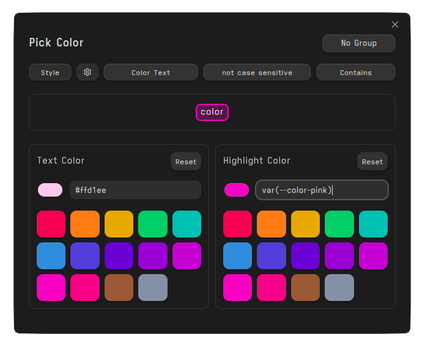

Customize your interface by hiding panels you don't need.

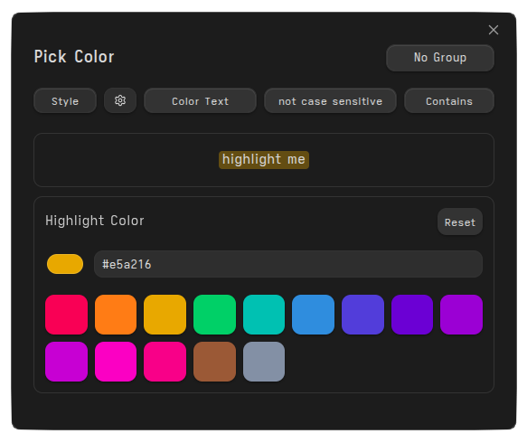

### Customizable Highlights

Make highlights look exactly how you imagine: adjust borders, corner shapes, transparency, and more.

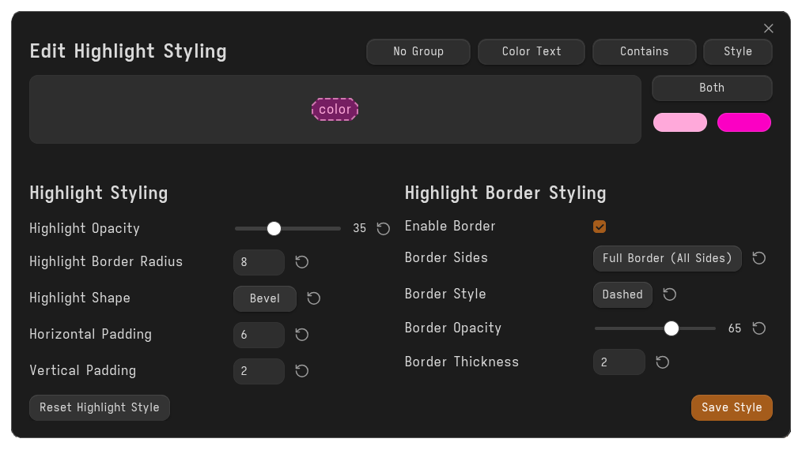

> Did you know? You can right-click on a color picker to open the Pick Color modal with your custom swatches.

### Custom CSS Styling

Take styling to the next level with per-entry and per-group custom CSS. When enabled, you can add advanced CSS to individual entries or entire word groups, including font size adjustments, gradients, and more!

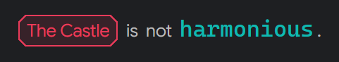

## Save all the styles you like!

A "Style" button pops up in every modal for you to apply your styles!
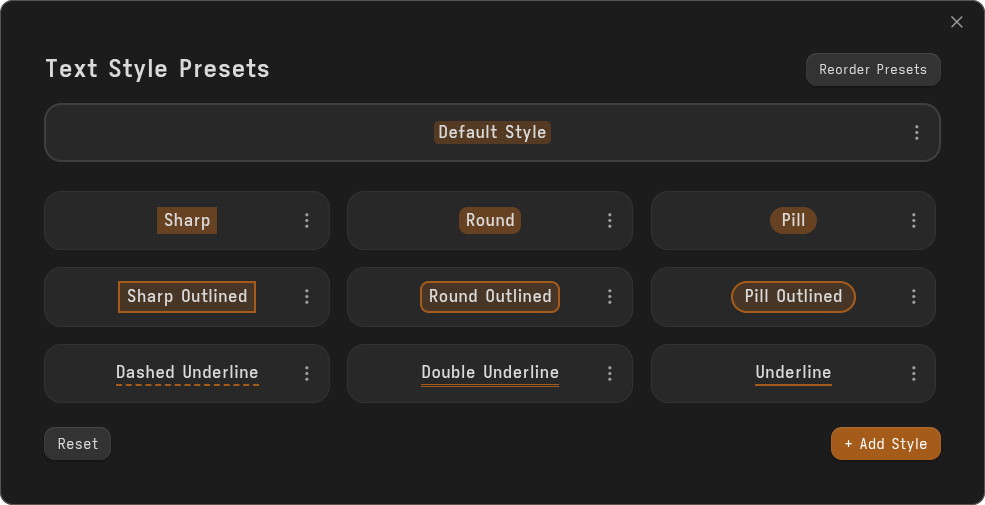

---
### Quick Menu

- **Quick Colors**: Choose a text color and a background color that appear directly in the right-click menu.

  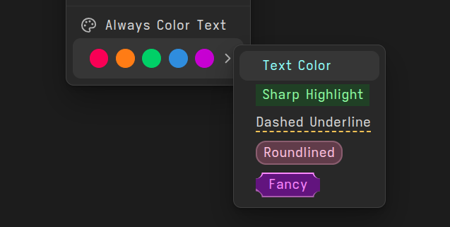

- **Quick Styles**: Apply a highlight style to selected text. Each Quick Style can be set to apply as either **Always Color Text** or **Inline HTML**.

  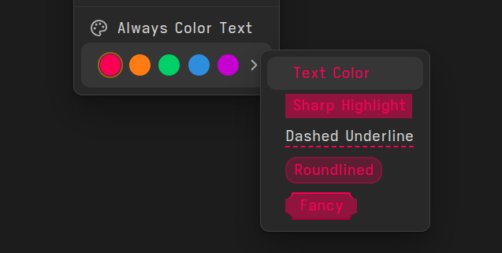

If **Quick Colors** are enabled, the applied style uses the selected Quick Color. If they are disabled, the style falls back to its own colors and inherits the colors set in Presets.

Word Groups and Match Types can also be assigned to a Quick Style!

#### How do I actually add Presets to the Quick Menu?

From the Edit Text Presets modal, you can click the ellipsis and choose the "Show in Quick Menu" option.
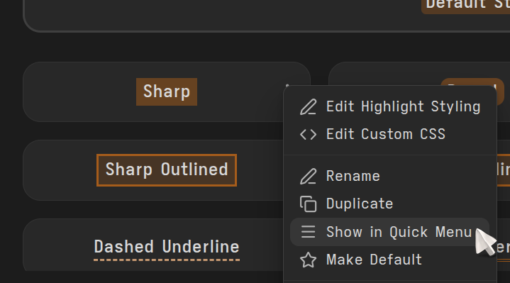


---

## Look & Feel
### Your Color Palette

Replace default swatches with your favorite colors for instant access!

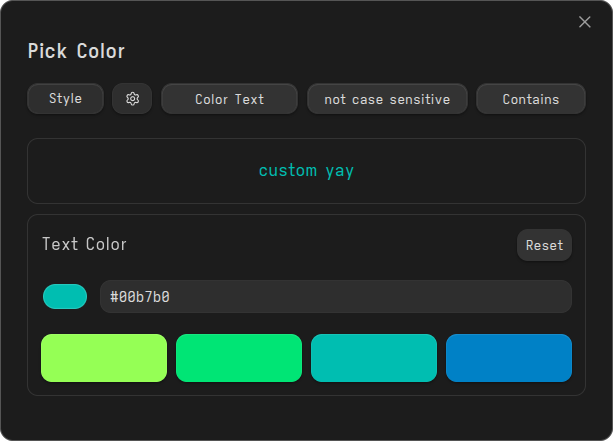

## Adjust Colors for Dark & Light Modes

Colors added in Dark mode can appear unreadable in Light mode. You can adjust your overall colors in the settings.
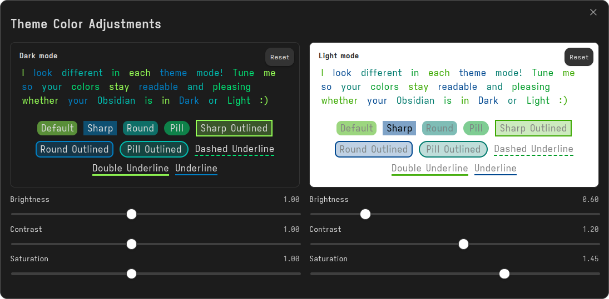

---

## Smart Text Matching

### Simple Matching
#### Match Types
Control *how* text is matched with flexible, per-entry options:

- **Contains** – matches anywhere in the word or text
- **Exact** – matches the full word only
- **Starts with** – matches text that begins with the entry
- **Ends with** – matches text that ends with the entry

#### Case Sensitivity
- **Case-sensitive** – Matches exactly as entered.
  - If the input is `Art`, only `Art` is colored. `ART` and `art` are not colored.
- **Case-insensitive** – Ignores letter case when matching.
  - If the input is `Art`, all case variations are colored, such as `Art`, `ART`, `art`, and `aRt`.

#### Color Targets
Choose exactly how your colors are applied with three targeting modes:

- **Color Text** – colors only the matched text (default)
- **Color Line** – colors the entire line containing the matched text
- **Color Next Line** – colors the line directly after the matched text


I personally love doing this for my tasks, using Color Line and a bit of custom CSS for center alignment.
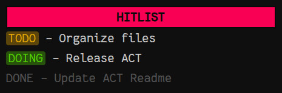

### Markdown Elements & Time Matching

Markdown elements like bold, links, etc., can be added from the Presets. The same goes for the "Time & Date" preset, which allows users to match time using the simple moment.js format.
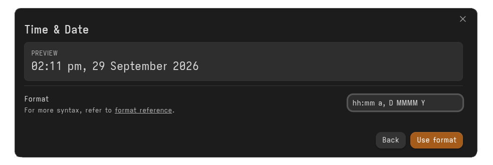

### Regex Matching

Regex Support allows you to add regex to color specific patterns. You can preview them in the Regex Tester before applying them.
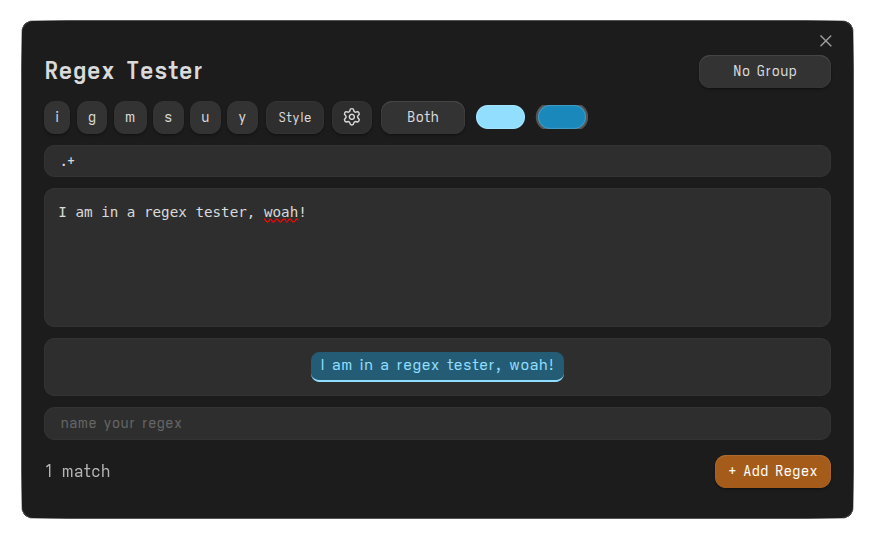

---

## Color Exclusion Rules

By default, colors apply all over your vault. To keep specific files from getting colored, you can set up rules.

### Single Entry & Word Group Rules

For both single colored texts and grouped entries, you can set up rules to keep specific files from being colored.

You can choose not to color in Specific Files and Folders, Files containing a specific tag or property, or even a File or Folder name pattern.

For example, I can have "TODO" get colored only in my tasks.md file, or have "TODO" get colored EVERYWHERE except in my files containing a `done` tag.

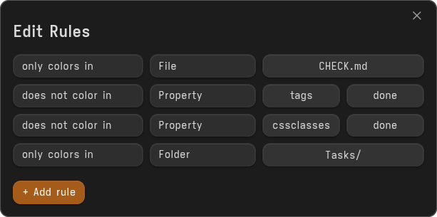

### Settings Rules
This one is a complete inclusion and exclusion. Whereas the earlier exclusion allowed you to color or not color different texts in different folders, this one completely excludes a file or folder, or excludes a parent folder while allowing coloring inside a child folder.

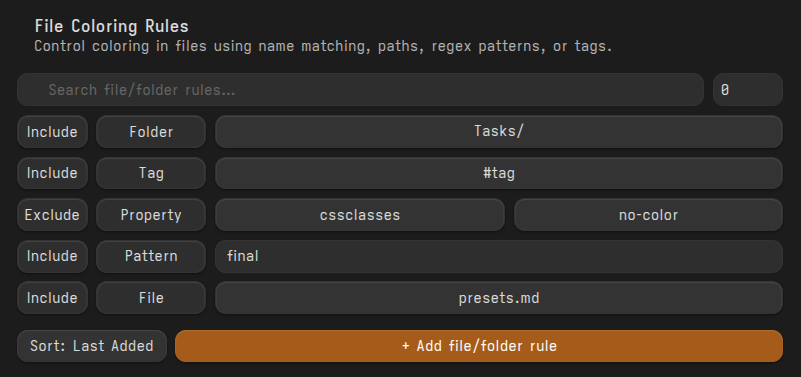


---

## Organize Your Colors

### Centralized Word Management

All colored texts appear in settings with search and multiple sort options.

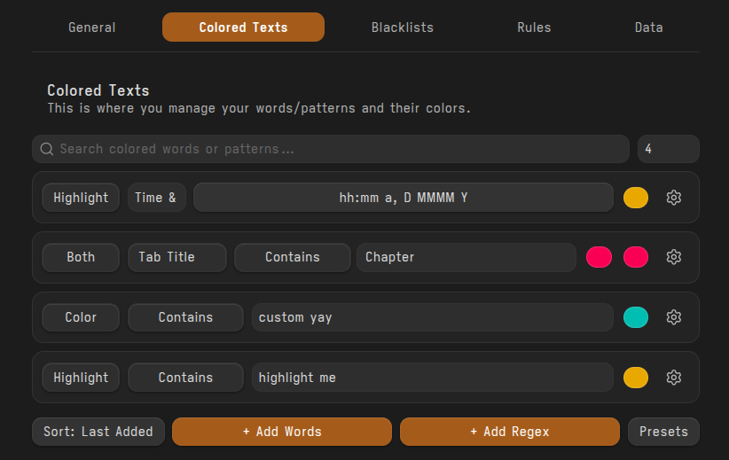

The coolest part about them is the ability to [[#Deactivate Entries|deactivate entries]] and [[#Entry Filtering (Limit Input)|limits]].


### Grouped Entries

Put multiple entries into a group.
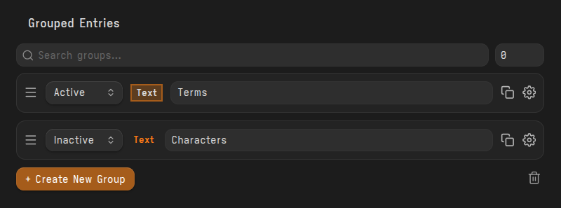

This allows you to apply a setting or style that all your grouped entries will use.


---

## Extra Features

### Deactivate Entries
In the Colored Texts tab, you can right-click on an entry and deactivate it so it stays but does not apply.
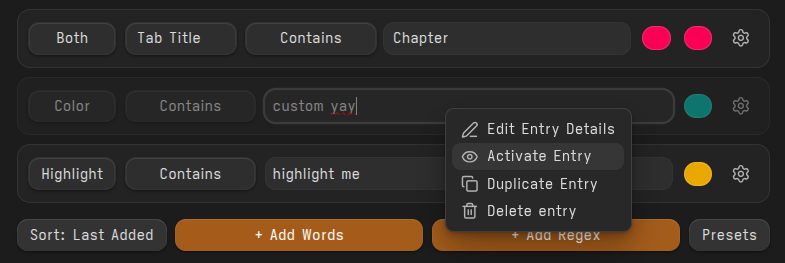

---
### Entry Filtering (Limit Input)

Use the **limit input** beside the search bar to instantly filter entries by type, match type, color target, status, or count.
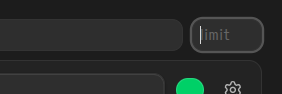

**Count & Display**

- `0` → show all entries
- `N` (number) → show only the last N entries

**Filter by Type**

- `r` → regex entries only
- `w` → word entries only
- `c` → colored text entries
- `h` → highlighted entries
- `b` → both text + highlight entries

**Filter by Match Type**

- `e` → exact match-type entries
- `sw` → starts-with match-type entries
- `ew` → ends-with match-type entries

**Filter by Color Target**

- `ct` → color text targeting entries
- `cl` → color line targeting entries
- `cc` → color next line targeting entries

**Filter by Status**

- `on` → active entries only
- `off` → deactivated entries only

---
### Add to Existing Entry
Select some text and choose **Add to Existing Entry** to add the selected text to an existing entry:
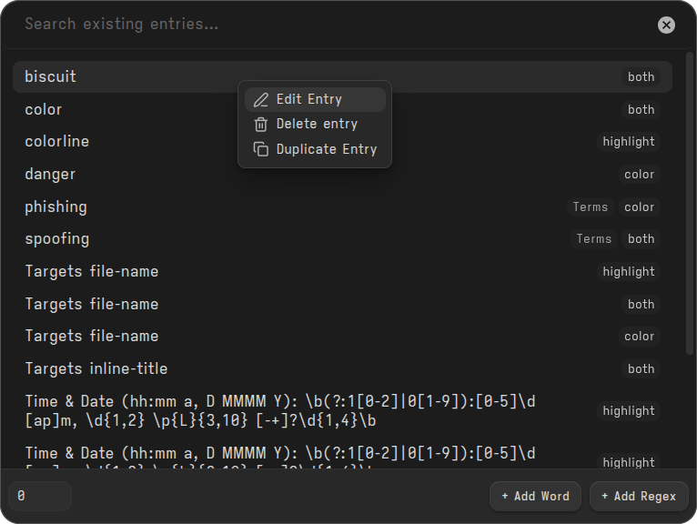

---
### Link Matches / Presets / Swatches
Found in **Settings → General → Advanced**. These keep shared styles in sync:
- **Link identical matchers:** edit a word or regex that several entries share, and you'll be asked whether to update all of them or only this one
- **Link swatch updates to text colors:** change a swatch once, and every text colored with it uses the updated color
- **Link preset updates to entries:** edit a preset, and the entries and word groups using it adopt the new style

---

### Optimization Settings

- **Word Completion Color**: Renders text colors only after a space is typed, which helps significantly with typing performance.
- **Lightweight Mode**: Skips partial match expansion and uses a stricter match limit for maximum performance.
- **Smart Updates**: Only updates active lines of the document to keep the editor responsive.

---

### Automatic Backups

Never lose your color settings! The plugin can automatically back up all your configuration to a folder inside your vault.

- **Scheduled Backups**: Hourly, daily, or weekly
- **One-Click Backup**: Manually trigger a backup anytime
- **Overwrite Option**: Replace the previous backup or keep multiple versions

Backups include all plugin data: colored texts, blacklists, file/folder rules, word groups, and settings. Restore via the "Import Data" button in settings.

---
### Display Commands

Hide commands you do not need or will never use.
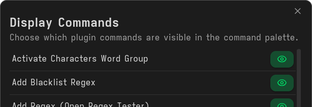

---
### One-Time Actions

- **Deprecation notice:** One-Time Actions will be removed and moved to a dedicated plugin.
- One-Time Actions allow you to apply HTML color to your files. They are inline coloring and cannot be disabled by the Global Toggle.

---

## Installation

Available in Obsidian Community Plugins. Check the [Release Notes](https://github.com/Kazi-Aidah/always-color-text/releases) for updates and new features.

### Questions or Suggestions?

Create a new issue [here](https://github.com/Kazi-Aidah/always-color-text/issues) to report bugs or request new features! I love seeing new issues to fix \\(≧ᗜ≦)/ and this plugin wouldn't have advanced so far without the feedback from users!!

---

## Contributing Translations

Want to add your language to Always Color Text?

1. Go to `src/i18n/` and copy `en.js`.
2. Rename it to your language code (like `es.js`, `fr.js`).
3. Translate the values only, like this:

```js
{
    "notice_import_completed": "ইম্পোর্ট সম্পন্ন",
    "key": "translation"
}
```

4. Go to `src/i18n.js` and add your language code to the list of supported languages.
5. Submit a pull request with your translation file in `src/i18n/`.

That's it! Your language will be available to all users.

### Contributors

- [@wanghong322](https://github.com/wanghong322) – Simplified Chinese Translation
- [@Frumkin13](https://github.com/Frumkin13) – Russian Translation

Thanks a lot to them for taking the time to translate Always Color Text!